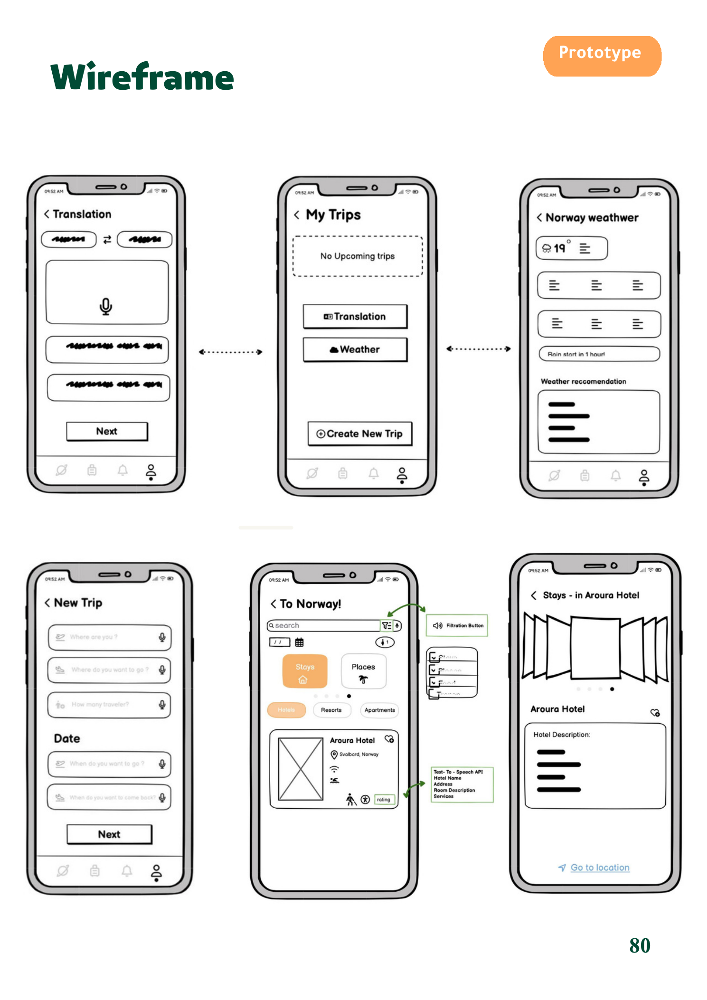
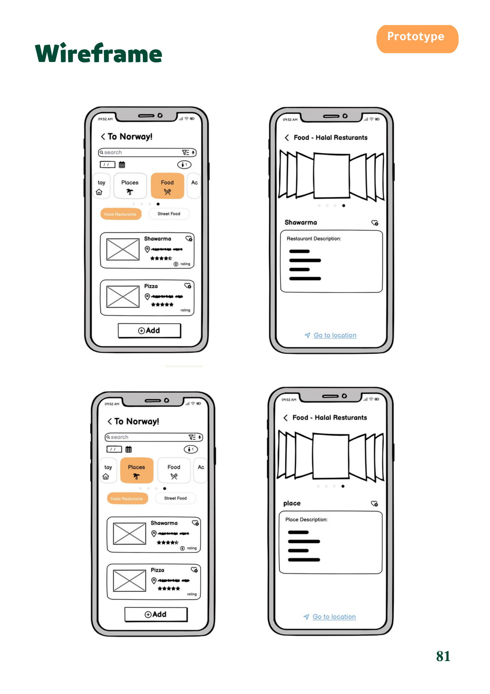
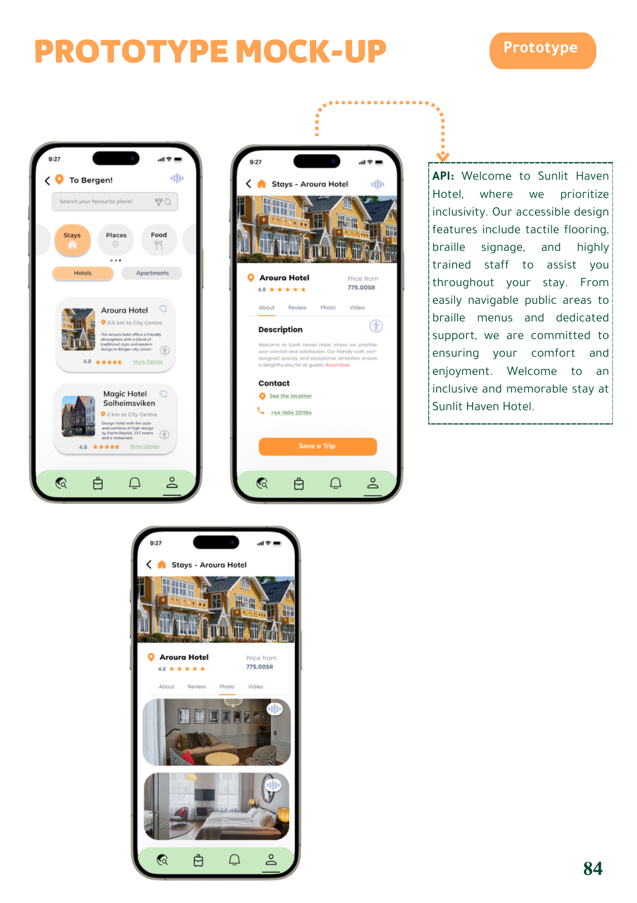

# Human-Computer Interaction: Bon Voyage

## Overview

Group UX project for **Bon Voyage**, a mobile-app concept intended to help travelers plan and manage travel activities. The project followed a user-centered design-thinking process from research through prototype evaluation.

## Objective

Understand traveler needs, define user problems, develop and evaluate mobile-app design alternatives, and iteratively improve the proposed experience.

## My Contribution

Co-authored the group project. The source report identifies Renad Alghamdi as a group member; it does not specify individual work allocation.

## Tools/Technologies

- Design thinking framework
- Interviews, observations, and user research artifacts
- Personas, user stories, and user journeys
- Competitive audit and ideation techniques
- Storyboards, wireframes, and prototype mock-ups
- Usability testing and feedback analysis

## Methodology

1. Defined project goals, target users, and user needs.
2. Conducted user-research activities and synthesized insights into personas, user stories, and journeys.
3. Defined problem statements and value propositions.
4. Conducted a competitive audit and generated solution ideas.
5. Developed low-fidelity storyboards and wireframes, then prototype mock-ups.
6. Evaluated the prototype with potential users and incorporated feedback through iteration.

## Key Work

- Addressed travel-planning needs including destination information, accommodation access, weather and packing guidance, language support, personalized offers, halal restaurant discovery, and accessibility considerations.
- Produced goal statements tied to user problems and measures of effectiveness.
- Created storyboards, wireframes, and prototype screens for priority scenarios.
- Used usability feedback to streamline interactions and reduce steps for tasks.

## Results/Findings

The report states that potential users expressed high satisfaction with the problem-solving approach and design solutions. Feedback also identified opportunities to improve usability and reduce the number of steps for some tasks; the team incorporated suggested refinements into an updated prototype.

## Visual Highlights

**Low-fidelity wireframes: Trip planning and utility features**

**Low-fidelity wireframes: Destination and restaurant discovery**

**High-fidelity prototype mock-up: Accommodation details and inclusive design**

## Deliverables

- UX research and design report
- Personas, user journeys, problem and goal statements
- Competitive audit and ideation outputs
- Storyboards, wireframes, and prototype mock-ups
- Usability-testing summary

The original course documents remain in this folder locally and are intentionally excluded from Git because they include student identifiers.

## Skills Demonstrated

User-centered design, requirements discovery, qualitative research, persona development, journey mapping, ideation, wireframing, prototyping, usability testing, and iterative product improvement.
