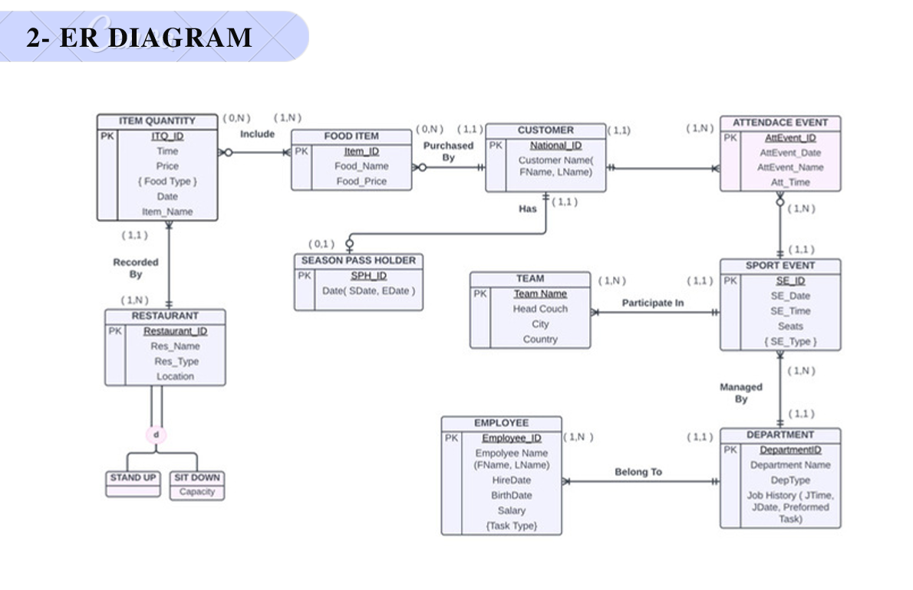
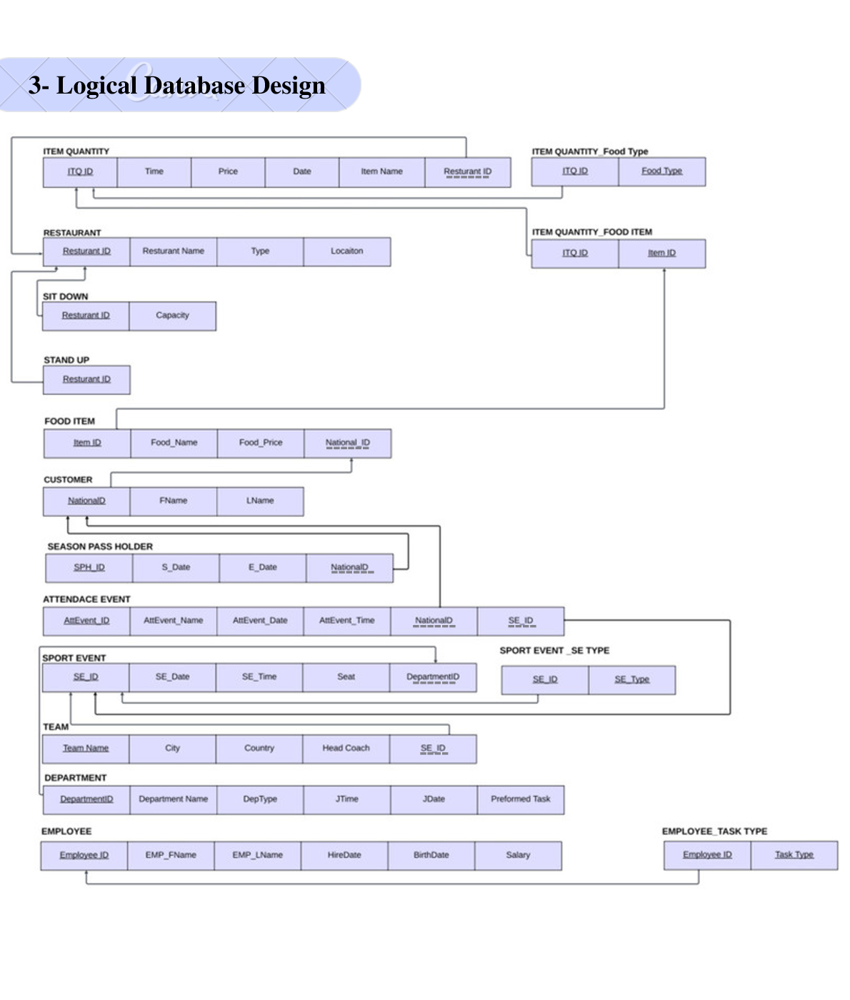
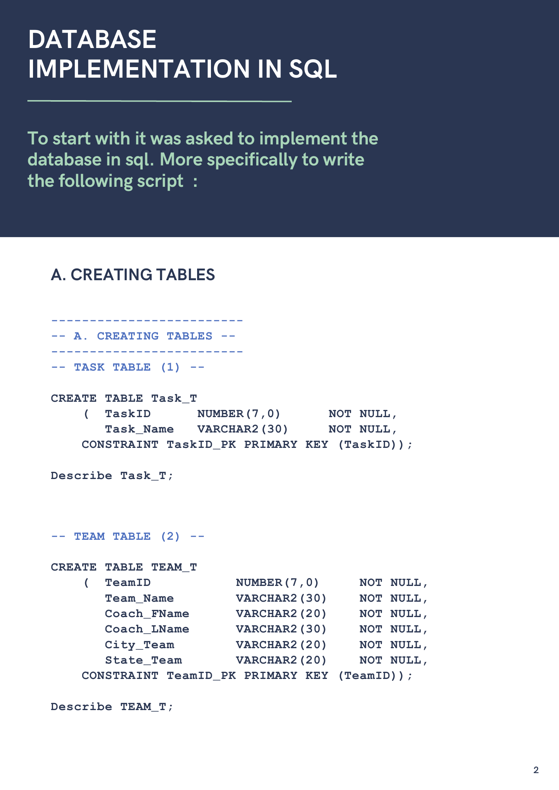

# Database Management Systems: Sports Stadium Database

## Overview

Group database-design and implementation project for a sports-stadium operations scenario. The work progressed from a conceptual data model to a normalized relational design, SQL implementation, sample data, and analytical queries.

## Objective

Create an efficient relational database that organizes stadium-related operational data while reducing redundancy and supporting retrieval and analysis.

## My Contribution

Co-authored the group project. The source reports identify Renad Alghamdi as a group member; they do not specify individual work allocation.

## Tools/Technologies

- Relational database design
- Entity-relationship (ER) modeling
- Normalization through third normal form
- SQL DDL and DML
- Primary keys, foreign keys, check constraints, joins, aggregation, and filtering

## Methodology

1. Identified the sports-stadium domain entities, attributes, and relationships.
2. Created a conceptual ER design and logical relational model.
3. Documented normalization through first, second, and third normal forms.
4. Implemented tables and integrity constraints in SQL.
5. Inserted sample records and wrote queries to answer operational questions.

## Key Work

- Modeled customers, season passes, employees, departments, teams, sporting events, attendance, food items, food orders, tasks, and task assignments.
- Implemented relational tables with keys and referential constraints.
- Added domain constraints for values such as department, food, and sport types.
- Wrote aggregation and join queries for ticket pricing, employee/department information, daily food sales, season-pass attendance, employee order totals, and event availability.
- Modified a food-order timestamp field to use a current-date default.

## Results/Findings

The completed report documents a normalized schema, SQL table definitions, inserted sample data, and operational SQL queries. The database work demonstrates how a relational model can organize related stadium operations data and support business questions.

## Visual Highlights

**Conceptual ER diagram (Crow's Foot notation)**

**Logical database design and relational schema**

**SQL table implementation and integrity constraints**

## Deliverables

- Conceptual ER diagram and relationship descriptions
- Logical database design and normalization documentation
- SQL table definitions, constraints, and sample data
- SQL modification and query set

The original course documents remain in this folder locally and are intentionally excluded from Git because they include student identifiers.

## Skills Demonstrated

Data modeling, ER design, normalization, SQL, database integrity, data manipulation, joins, aggregation, and translating operational needs into relational structures.
