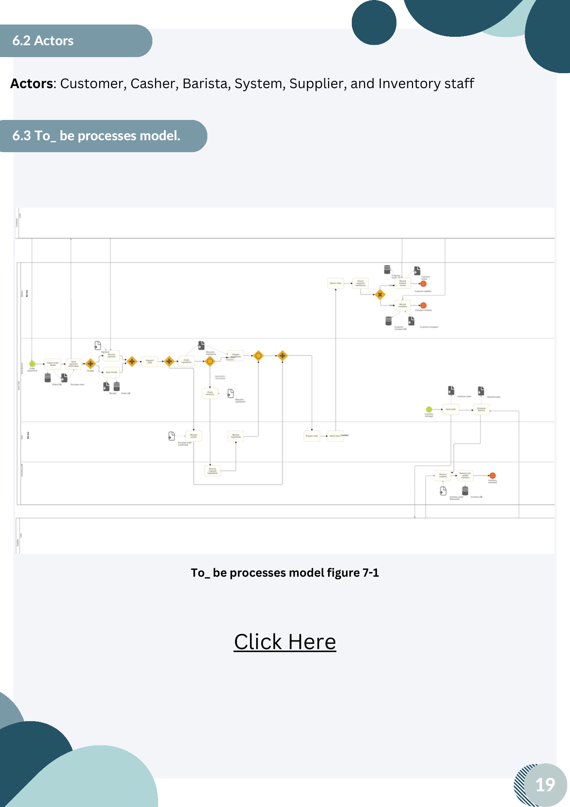
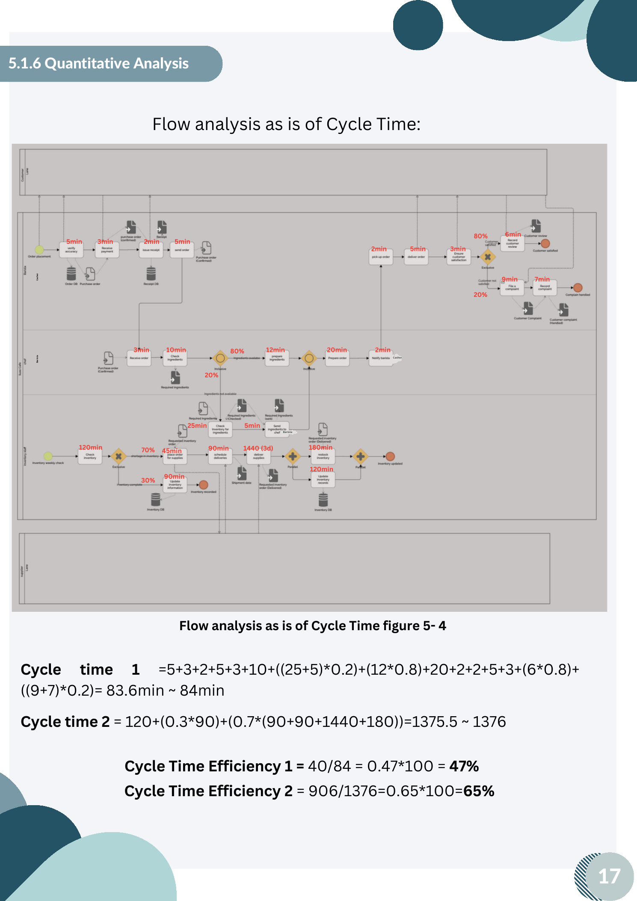
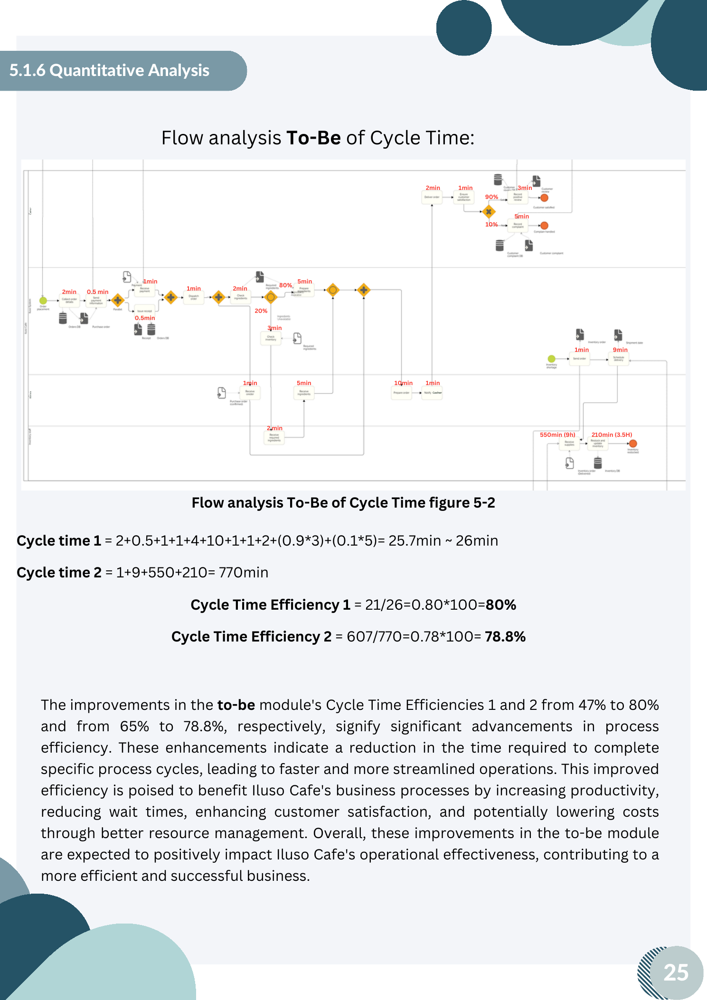

# Business Process Management: Iluso Cafe Process Redesign

## Overview

Group business-process management project for Iluso Cafe. The project documented current service and inventory workflows, designed a future-state process, and evaluated the expected effect of process-improvement heuristics on time and efficiency.

## Objective

Improve cafe order fulfillment, inventory management, supplier communication, and customer-satisfaction activities through a redesigned process.

## My Contribution

Co-authored the group project. The source report identifies Renad Alghamdi as a group member; it does not specify individual work allocation.

## Tools/Technologies

- As-Is and To-Be process models
- Process-improvement heuristics
- Flow analysis
- Processing-time and cycle-time analysis
- Process assessment using health, importance, and feasibility criteria

## Methodology

1. Gathered operational information about order taking, payment, preparation, inventory, suppliers, and customer feedback.
2. Mapped the current process and identified manual, sequential, and communication-heavy activities.
3. Designed a To-Be process with system-supported order handling, payment/receipt steps, inventory status updates, supplier notifications, and digital feedback handling.
4. Applied task-composition, parallelism, automation, and communication-optimization heuristics.
5. Compared processing time and cycle-time efficiency between the current and proposed process models.

## Key Work

- Modeled interactions among customers, cashier, barista, inventory staff, suppliers, and the system.
- Consolidated inventory-restocking and record-update activities.
- Redesigned payment and receipt activities to run together after system-based order capture.
- Proposed automated inventory monitoring and supplier notification when stock reaches a defined threshold.
- Quantified proposed cycle-time efficiencies for two process paths.

## Results/Findings

The report's To-Be analysis shows cycle-time efficiency increasing from **47% to 80%** for one path and from **65% to 78.8%** for another. The report presents these as modeled improvement outcomes, intended to reduce waiting and manual work; they are not measured live-business results.

## Visual Highlights

**Redesigned To-Be process model**

**As-Is flow analysis and cycle-time efficiency**

**To-Be flow analysis and cycle-time efficiency improvements**

## Deliverables

- Current and proposed process models
- Process-heuristic analysis
- Processing-time and cycle-time calculations
- Expected-benefits assessment
- Process-assessment appendix

The original course documents remain in this folder locally and are intentionally excluded from Git because they include student identifiers.

## Skills Demonstrated

Business process analysis, process mapping, workflow redesign, automation analysis, quantitative process evaluation, operational improvement, and stakeholder-oriented process communication.
