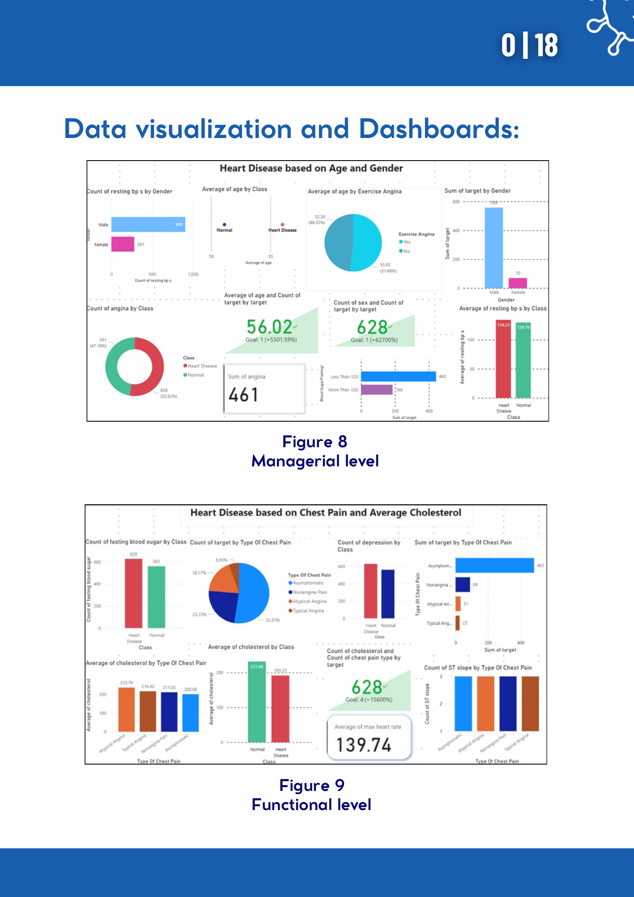
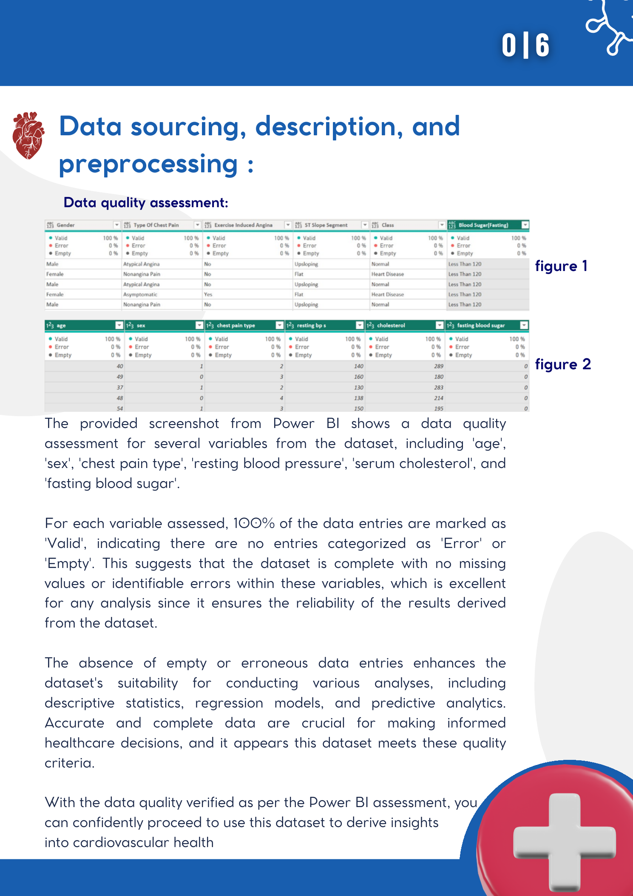
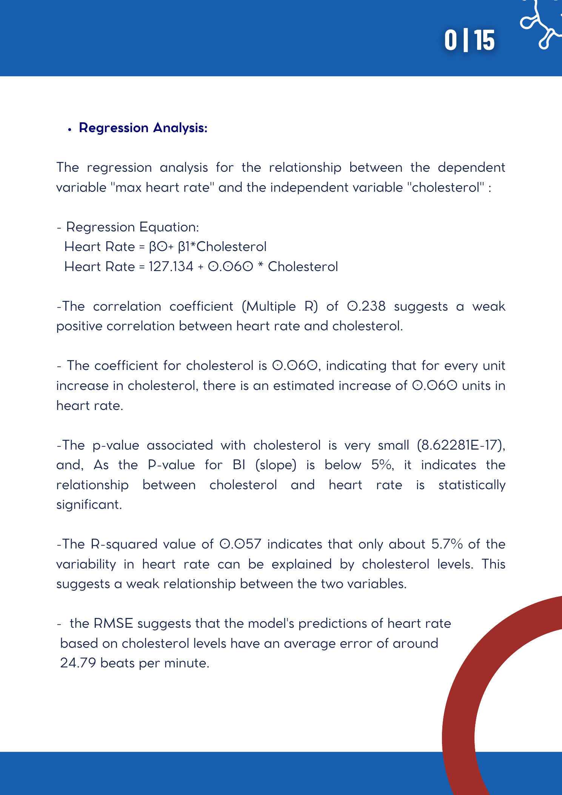

# Business Intelligence: Heart Disease Data Analysis

## Overview

Group business-intelligence project that analyzed a heart-disease dataset sourced from Kaggle. The work included data-quality assessment, preparation, descriptive analysis, regression analysis, KPI-oriented research questions, and Power BI dashboards.

## Objective

Use a structured BI workflow to examine relationships among demographic and cardiovascular variables, communicate findings through dashboards, and develop data-informed recommendations. This is an academic data-analysis project and is not clinical guidance.

## My Contribution

Co-authored the group project. The source report identifies Renad Alghamdi as a group member; it does not specify individual work allocation.

## Tools/Technologies

- Power BI
- Microsoft Excel
- Data-quality assessment and data preparation
- Descriptive statistics
- Regression analysis
- KPI and research-question design
- Dashboard design for managerial and functional audiences

## Methodology

1. Selected and described a public heart-disease dataset from Kaggle.
2. Assessed data quality in Power BI and documented valid, error, and empty-value checks.
3. Prepared the data, including splitting a combined column into separate fields in Excel.
4. Defined research questions and KPIs covering age, sex, chest-pain type, blood pressure, cholesterol, blood sugar, exercise angina, maximum heart rate, oldpeak, and ST slope.
5. Applied descriptive statistics and regression analysis.
6. Designed dashboards with charts and tables for managerial and functional perspectives.

## Key Work

- Documented 100% valid entries for the assessed fields in the Power BI data-quality checks.
- Analyzed descriptive measures and distributions for age, chest-pain type, sex, blood pressure, cholesterol, and fasting blood sugar.
- Modeled the relationship between cholesterol and maximum heart rate.
- Created visual dashboards to communicate analytical relationships and trends.

## Results/Findings

The regression model reported a weak positive cholesterol-to-maximum-heart-rate relationship (**Multiple R = 0.238; R-squared = 0.057**). The report appropriately notes that cholesterol alone explained a small portion of variation in maximum heart rate, indicating the need to consider additional factors. The findings are limited to the project dataset and should not be treated as medical advice.

## Visual Highlights

**Interactive Power BI dashboards (Managerial and Functional views)**

**Data quality assessment in Power BI**

**Regression analysis (Cholesterol vs. Maximum Heart Rate)**

## Deliverables

- BI analysis report
- Data-quality and data-preparation documentation
- Research questions and KPI definitions
- Descriptive and regression-analysis outputs
- Managerial and functional dashboard views
- Findings, recommendations, and future-directions discussion

The original course documents remain in this folder locally and are intentionally excluded from Git because they include student identifiers.

## Skills Demonstrated

Data preparation, data quality validation, analytical-question design, KPI definition, descriptive statistics, regression interpretation, dashboard design, and insight communication.
